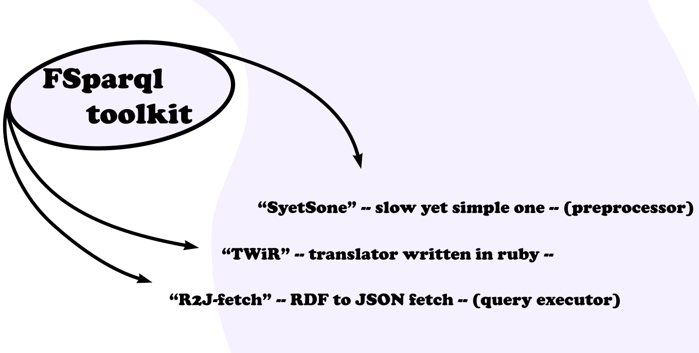

## FSparql
Flexible Sparql<br>
<br>
***We provide basic (plain FSparql) syntax and concise API,***<br>
***but you can inject your own style right into the system with ease.***<br>
### About
FSparql is a programming language and you are at a page which contains<br>
its implementation.
<br>
FSparql aims at simplicity and flexibility (F - flexible).<br>
Following the Unix philosophy, toolkit divided into multiple parts:
  * preprocessor
  * translator (converts sources into valid Sparql)
  * sparql executor

The good part: you can use them separately.<br>
<br>
If you choose all 3 of them, `sh` scripts are there for your convinience.<br>
<br>

### Preprocessor
Allows simple text substitution before invoking the translator.<br>
Say, you sick of `PROP` and `EXC` or even `INC` short forms.<br>
Well, define your own syntax!<br>
```
(PROPERTY) PROP
(EXCLUSIVE) EXC
(INCLUSIVE) INC
```
It can handle variables:
```
(swap $x + $y) $y + $x
```
Defined this way, fragement `swap foo + bar` going to be replaced<br>
with `bar + foo`.<br>
### Translator
Takes FSparql source code and outputs Sparql equivalent.<br>
When the translator 'sees' the input, it should not contain any<br>
arbitrary text, no preprocessing is done by translator (actually,<br>
it does some input manipulations).<br>
<br>
Example of valid input:
```
# Raw FSparql. Pretty verbose.
# This is commentary, should not be interpreted.
OBJ lang EXC VAL dbpedia-owl:ProgrammingLanguage {
  PROP name INC VAL rdfs:label [@LANG == 'en']
  PROP year INC VAL dbpprop:year
  OBJ author EXC VAL dbpedia-owl:designer {
    PROP name INC VAL rdfs:label [@LANG == 'en']
    PROP depiction OPT INC VAL foaf:depiction
  }
}

```
Output for above:
```
SELECT ?lang__name, ?lang__year, ?lang__author__name, ?lang__author__depiction {
  ?lang a dbpedia-owl:ProgrammingLanguage.
  ?lang rdfs:label ?lang__name.
  ?lang dbpprop:year ?lang__year.
  ?lang dbpedia-owl:designer ?lang__author.
  ?lang__author rdfs:label ?lang__author__name.
  OPTIONAL {
    ?lang__author foaf:depiction ?lang__author__depiction.
  }
  FILTER(LANG(?lang__name) = 'en')
  FILTER(LANG(?lang__author__name) = 'en')
}
```
Translator receive command line arguments for LIMIT, OFFSET, etc.<br>
Example: `fsparql file1.query file2.query --limit=100 -offset=20 > res.json`<br>
### Sparql executor
Executor connects with remote source, passes Sparql query<br>
and transforms results.<br>
<br>
For above query we could get json like:
```
[{
  "lang__name": "C",
  "lang__year": "1972",
  "lang__author__name": "Dennis",
  "lang__author__depiction": "Ritchie face!"
}, {
  "lang__name": "Go",
  "lang__year": "2009",
  "lang__author__name": "Rob",
  "lang__author__depiction": "Pike face!"
}]
```
But we propaby want something similar to:
```
[{
  "lang": {
    "name": "C",
    "year": "1972",
    "author": {
      "name": "Dennis",
      "depiction": "Ritchie face!"
    }
  }
}, {
  "lang": {
    "name": "Go",
    "year": "2009",
    "author": {
      "name": "Rob",
      "depiction": "Pike face!"
    }
  }
}]
```
And executor provides 2-nd format for us.<br>
So, it executes the valid Sparql and then modifies the response.<br>
